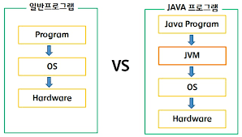
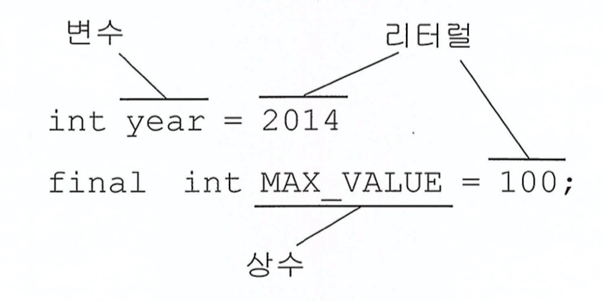
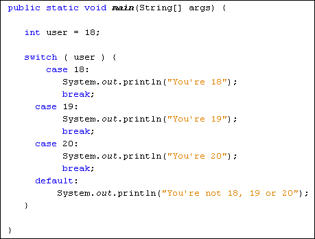

[Java 정석 1~5강]

### java의 특징
1. 운영체제에 독립적  
: 운영체제나 하드웨어가 아닌 JVM과 통신하고, JVM이 자바 응용프로그램으로부터 전달받은 명령을 해당 운영체제가 이해할 수 있도록 변환하여 전달

2. 객체지향언어  
: 재사용성, 유지보수의 용이성

3. garbage collector가 자동으로 메모리 관리

4. 멀티쓰레드 지원  
: 여러 쓰레드에 대한 스케쥴링을 자바 인터프리터가 담당한다

5. 동적 로딩 지원  
: 필요한 시점에 클래스 로딩하여 사용  
: 일부 클래스가 변경되어도 전체 애플리케이션 다시 컴파일하지 않아도 된다 - 유연한 애플리케이션 작성 가능

 
### JVM
1. JVM(Java Virtual Machine): 자바가상머신, 자바를 실행하기 위한 가상 기계(컴퓨터)

2. java로 구현된 애플리케이션은 모두 이 가상 컴퓨터에서만 실행된다.  
일반 애플리케이션의 코드는 OS만 거치고 하드웨어로 전달되지만, Java 애플리케이션은 JVM을 한번 더 거친다(실행 시 interpret - 속도 느려짐)

3. java 애플리케이션은 OS 종속적이지 않아, OS와 하드웨어 독립적이라고 볼 수 있다.  
단, 각 OS에서 실행가능한 JVM이 필요

* * *

### 변수
변수(variable)
- 하나의 값을 저장할 수 있는 공간

상수(constant)
- 값을 한번만 저장할 수 있는 공간
- 변수와는 달리, 한번 저장하면 다른 값으로 변경 불가 / 변수 앞에 final 명시

리터럴(literal)
- 그 자체로 값을 의미하는 것 (상수의 값)


* * *

### 연산자
형변환 연산자(casting operator)
- 변수, 리터럴의 타입을 다른 타입으로 변환 (서로 다른 타입간의 연산 위해)

자동 형변환
- 형변환이 생략된 경우, 컴파일러가 생략된 형변환을 자동으로 추가한다
- 기존값을 최대한 보존할 수 있는 타입으로 자동 형변환 (표현범위가 더 넓은 쪽 ex. byte → int → long → double)

문자열의 비교
- 두 문자열을 비교할 경우, ‘==’가 아닌 equals() 사용해야 함
(내용이 같아도 서로 다른 객체이므로 비교할 수 없음)

* * *

### switch문
- 단 하나의 조건식으로 많은 경우의 수 처리 가능
- 조건식의 결과값이 반드시 정수여야 함
- case문의 값은 반드시 상수여야 함 (변수, 실수 x)


* * *

### 배열
배열(array)
- 같은 타입의 여러 변수를 하나의 묶음으로 다루는 것

선언
- 배열을 다루기 위한 참조변수를 위한 공간 생성

생성
- 값 저장할 수 있는 공간 생성 → 연산자 ‘new’ + 타입, 길이 지정
```
타입[] 변수명;              // 배열을 선언 (배열 다루기 위한 참조변수 선언)
변수이름 = new 타입[길이];   // 배열을 생성 (실제 저장공간을 생성)

int[] score = new int[5]; // 배열 선언, 생성 동시에 하기
```

인덱스(index)
- 배열의 요소마다 붙여진 일련번호

길이
- 배열은 한 번 생성하면 길이를 변경할 수 없음 → length 로 구해진 값은 상수!

초기화
- 저장할 값들을 {} 안에 쉼표로 구분하여 나열 

```
int[] score = new int[]{10, 20, 30};  // 배열의 생성, 초기화 동시에 진행

int[] score = new int[]{10, 20, 30};
int[] score = {10, 20, 30};           // new int[]를 생략할 수 있음
```

- 배열의 선언, 생성을 따로 하는 경우 생략할 수 없다

```
int[] score;          
score = {10, 20, 30};         // error (new int[] 생략할 수 없음)
score = new int[]{10, 20, 30} // ok
```

출력
- char 배열 제외하고는 ‘타입@주소’ 형식으로 출력된다. (배열을 가리키는 참조변수 출력)

 

### Arrays 클래스

문자열 비교, 출력 - toString(), deepToString(), equals(), deepEquals()

```
int[] arr = {0,1,2,3,4};
int[][] arr2D = {{11, 12}, {21,22}};

soutv(Arrays.toString(arr));        // [0,1,2,3,4]
soutv(Arrays.deepToString(arr2D));  // [[11, 12], [21,22]]

String[][] str2D  = new String[][]{{"aaa","bbb"},{"AAA","BBB"}};
String[][] str2D2 = new String[][]{{"aaa","bbb"},{"AAA","BBB"}};

soutv(Arrays.equals(str2D, str2D2));      // false
soutv(Arrays.deepEquals(str2D, str2D2));  // true
```

문자열 복사 - copyOf(), copyOfRange()

```
int[] arr = {0,1,2,3,4};

int[] arr2 = Arrays.copyOf(arr, arr.length); // arr2 = [0,1,2,3,4] <- 배열 전체 복사 
int[] arr3 = Arrays.copyOf(arr, 3);          // arr3 = [0,1,2]
int[] arr4 = Arrays.copyOf(arr, 7);          // arr4 = [0,1,2,3,4,0,0]
int[] arr5 = Arrays.copyOfRange(arr, 2, 4);  // arr5 = [2,3] <- 배열 일부 복사 / 4 불포함
int[] arr6 = Arrays.copyOfRange(arr, 0,7);   // arr6 = [0,1,2,3,4,0,0]
```

문자열 정렬 - sort()

```
int[] arr = {3,2,0,1,4};

Arrays.sort(arr);                          // 배열 arr을 정렬
System.out.println(Arrays.toString(arr));  // [0,1,2,3,4]
```

### String 클래스
- 문자열 처리 시 char배열이 아닌, String 클래스 사용하는 이유 → char 배열에 여러가지 기능(method) 추가한 것이므로!
- 객체지향언어는 데이터/그와 관련된 기능을 하나의 클래스에 묶어서 다룸
- 읽을수만 있으며, 변경 불가(변경은 StringBuffer 클래스 사용)
