[Java 정석 6강]
# 객체지향 프로그래밍 (1)

### 객체지향 프로그래밍
- 코드 간에 서로 관계를 맺어  줌으로써 보다  유기적으로 프로그램을 구성하는 것
- 거시적 관점에서 설계하는 능력 요구 (기능적으로 완성 후 코드 개선 노리는 것이 좋다)  
  
[장점]
1. 높은 코드 **재사용성**: 기존의 코드 이용하여 쉽게 작성
2. 코드 관리 용이: 코드의 관계를 이용하여 적은 노력으로 쉽게 코드 변경 (**유지보수**)
3.  신뢰성이 높은 프로그램: 제어자, 메서드 → 데이터 보호하고 올바른 값 유지 / **코드 중복제거** → 코드 불일치로 인한 오작동 방지


### 클래스와 객체

클래스는 객체를 생성하는데 사용될 뿐, 객체 그 자체는 아님.  
원하는 기능의 객체 사용하기 위해서는 **클래스로부터 객체 생성하는 과정이 선행**되어야 함 (클래스 작성 후 클래스로부터 객체 생성)

```
클래스 (class)
- 정의: 객체를 정의해 놓은 것 / 객체의 설계도, 틀
- 용도: 객체를 생성하는데 사용
- 객체의 모든 속성, 기능 정의

객체 (object)
- 정의: 클래스에 정의된 내용대로 메모리에 생성된 것 / 실제로 존재하는 것 (사물, 개념)
- 용도: 객체가 가지고있는 기능, 속성에 따라 다름
- 속성/기능(객체의 member)의 집합

"객체를 사용한다" == 객체가 가지고 있는 속성과 기능을 사용한다
"클래스로부터 객체 생성한다" == 클래스에 정의된 속성, 기능을 가진 객체가 만들어진다
```

### 객체의 구성요소
- 속성 (property) - 멤버변수 (variable)
- 기능 (function) - 메서드 (method)

```
class Tv {
    boolean power;
    int channel;
    
    void power() {
        power = !power;
    }
    
    void channelUp {
        channel++;
    }
}
```

### 객체와 인스턴스

* instance(인스턴스)  
: 어떠한 클래스로부터 만들어진 객체

* instantiate(인스턴스화)  
: 클래스로부터 객체를 만드는 과정
주로 어떤 클래스로부터 만들어졌는지 강조하는 의미로 쓰인다 (문맥에 따라 쓰임)  
(인스턴스는 참조변수를 통해서만 다룰 수 있으며, 참조변수의 타입은 인스턴스의 타입과 일치해야 한다)


```
"인스턴스화"
클래스 --> 인스턴스 (객체)

예시)
책상은 인스턴스다 -> 책상은 객체다
책상은 책상클래스의 객체이다 -> 책상은 책상클래스의 인스턴스다
```

***

### 클래스의 정의

1. 데이터와 함수의 결합
   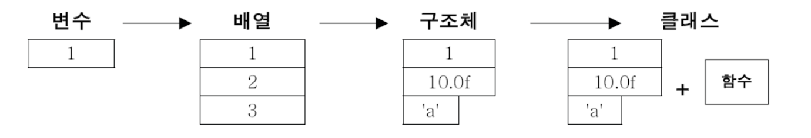
```
변수:   하나의 데이터를 저장할 수 있는 공간
배열:   같은 종류의 여러 데이터를 하나의 집합으로 저장할 수 있는 공간
구조체:  서로 관련된 여러 데이터를 자료형 종류에 관계없이 하나의 집합으로 저장할 수 있는 공간
클래스:  데이터와 함수의 결합 (구조체 + 함수)
```
서로 관계가 깊은 **데이터(변수)** 와 **데이터에 관련된 메서드**의 집합 → **클래스**


2. 사용자 정의 타입

프로그래밍 언어에서 제공하는 type  
: 기본 자료형(primitive type) / 참조 타입(reference type) / 사용자 정의 타입(user-defined type)

|**type**|**example**|
|------|---|
|**기본 자료형** (primitive type)|char, int, float, double, boolean → 기본 자료형을 다루기 위한 [Wrapper Class](https://coding-factory.tistory.com/547)|
|**참조** 타입 (reference type)|interface, **class** → **사용자 정의 타입** (user-defined type)|

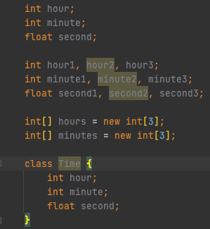

변수를 매번 새로 선언하는  대신, **필요한 데이터를 하나로 묶는 사용자정의 타입**(class)를 통해 해결할 수 있다.  
(class 생성 후 set 등의 제어자를 통해 값 직접 변경하지 못하게 하고, 메서드를 통해 값을 변경하는 등 할 수 있음)

***

### 변수 (Variable)

변수의 선언 위치에 따라 종류가 달라진다.

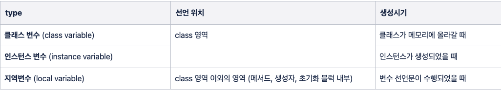

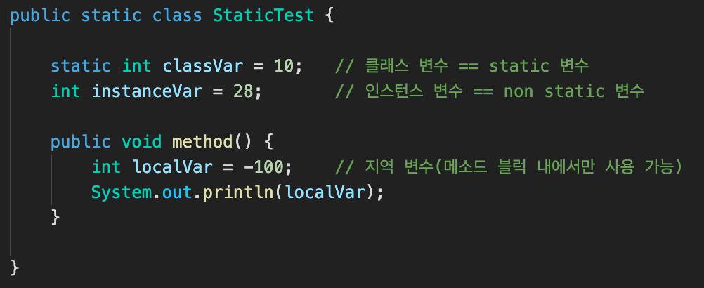

1. 클래스 변수 (공통 속성)  
a. iv 앞에 static 붙이면 됨  
b. 인스턴스 생성하지 않고 언제라도 바로 사용할 수 있음  
c. 모든 인스턴스가 공통된 **하나의 저장공간(변수)** 공유 → 한 클래스의 모든 인스턴스들이 **공통적인 값**을 유지해야하는 속성일 시 사용


2. 인스턴스 변수 (개별 속성)  
a. 클래스 영역에 선언하며, 인스턴스 생성 시 만들어짐 → iv 값 읽거나 저장하려면 먼저 인스턴스 생성해야 함  
b. 인스턴스마다 **별도의 저장공간(서로 다른 값)** 가짐 → **인스턴스마다 고유**한(각기다른) 상태 유지해야하는 경우 사용


3. 지역변수  
a. 메서드 내 선언 → 메서드 내에서만 사용 가능 / 메서드 종료 시 소멸
   
### 멤버변수

* 클래스 영역에 선언된 변수
* 클래스 변수(static변수) / 인스턴스 변수 모두 통칭

*** 

### 메서드 (Method)
- 특정 작업을 수행하는 일련의 문장들을 하나로 묶은 것
- 넣을 값(입력)과 반환 결과(출력)만 알면 된다
- “메서드를 정의한다” → 선언부(header), 구현부(body) 작성하는 것

1. 선언부  
a. 메서드 이름, 매개변수 선언, 반환타입으로 구성 → 후에 변경하게 되면 호출하는 모든 곳이 바뀌어야 하므로, 신중히 작성
   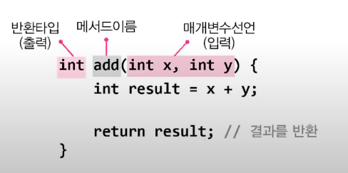
b. 매개변수 선언 (**parameter** declaration)  
   -> 메서드 작업 수행시 필요한 값들 입력받기 위한 것  
c. 반환 타입 (return type)  
   -> 메서드 작업 수행 결과인 반환값(return value)의 타입 명시 - 없을 경우 void!


2. 구현부  
a. 메서드 호출 시 수행될 문장들 작성  
b. 지역변수 (local variable)  
   -> 메서드 내에 선언된 변수  
   -> 매개변수도 메서드 내에 선언된 것으로 간주된다  
c. return문  
   > 반환타입과 일치하거나, 자동 형변환이 가능한 것이어야 함  
   메서드 입력값(매개변수)는 여러개여도 반환값(출력)은 최대 하나.  
   실행중인 메서드 종료하고, 호출한 메서드로 돌아간다  
   void가 return문이 없어도 되는 이유 → 컴파일러가 자동으로 `return;` 추가하였기 때문

3. 호출
- main메서드는 프로그램 실행 시 OS에 의해 자동으로 호출
- 인수, 인자 (argument): 메서드 호출 시 지정하는 값
- 호출스택(call stack)  
  -> 메서드 작업에 필요한 메모리 공간 제공  
   -> 호출 시, 호출스택에 메서드를 위한 **메모리 할당** → 작업 수행하는 동안 지역변수(매개변수 포함)들과 연산의 **중간 결과 저장** → 메서드 작업 끝나면 할당된 공간은 **반환**되어 **비워짐**
  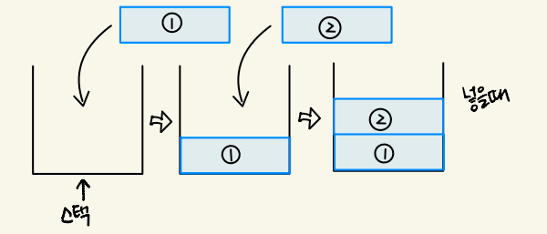

***

### 매개변수

- 메서드 호출 시 매개변수로 지정한 값을 메서드의 매개변수에 복사해서 넘겨줌
- 기본형 → 기본형 값 복사 / 참조형 → 인스턴스의 주소 복사

1. 기본형 매개변수 (read only)

값을 넘겨준다 = 원본이 아닌 복사본이므로, 원 데이터는 영향 x  
→ 변수에 저장된 값만 읽을 수 있고 변경할 수 없다.

2. 참조형 매개변수 (read & write)

값이 저장된 주소를 넘겨준다  
→ 읽는 것 , 변경하는 것 모두 가능하다

***

### 클래스 메서드(static) / 인스턴스 메서드

* 인스턴스 메서드  
: 메서드의 작업을 수행하는데 인스턴스 변수를 필요로 하는 메서드  
: 인스턴스 변수는 인스턴스(객체)를 생성해야만 만들어짐 → 인스턴스 메서드 역시 인스턴스를 생성해야만 호출 가능

* 클래스 메서드 (static method)  
:  인스턴스와 관계없는(인스턴스 변수, 메서드 사용 안함) 메서드
  
  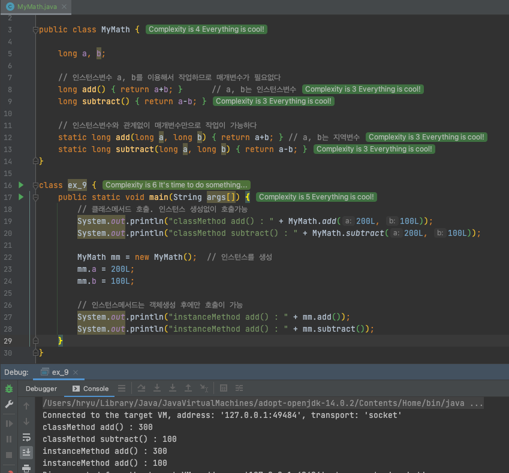
매개변수만으로 작업 수행하는 클래스메서드는 객체생성 없이도 바로 호출이 가능하며,
인스턴스 메서드는 객체 생성 후에 호출 가능하다.
  

* static은 언제 붙이는가?  
1. 멤버변수 중 모든 인스턴스에 공통으로 사용되는 대상  
->  모든 인스턴스에서 같은 **값이 유지되어야 하는 변수** → static 붙여서  **클래스변수**로 정의

2. 클래스 변수는 인스턴스 생성하지 않아도 사용 가능  
-> 클래스 변수(static)는 클래스가 메모리에 올라갈 때 이미 자동적으로 생성

3. 클래스 메서드는 인스턴스 변수 사용 불가  
-> 인스턴스 변수와는 달리, 클래스 메서드는 인스턴스 생성 없이 호출 가능함
  → 호출 시점에 인스턴스 존재하지 않을 수도 있기에 인스턴스 변수 사용 불가!  
-> 인스턴스 변수가 존재한다는 것은 static 변수가 이미 메모리에 존재한다는 것
  → static 멤버들 언제든지 사용 가능

4. 메서드 내 **인스턴스 변수를 사용하지 않는다**면, **static** 고려하기  
-> 메서드 호출시간이 짧아지므로, 성능 향상 됨

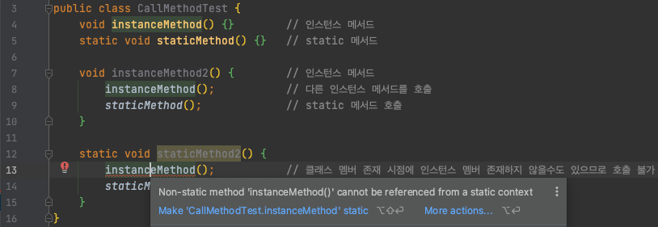
클래스 멤버가 존재하는 시점에 인스턴스 멤버 존재하지 않을 수도 있기 때문에 호출 불가

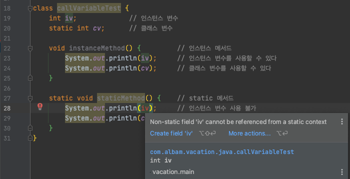
변수-메서드 간 호출 & 참조

***

### 오버로딩 (overloading)
- 같은 클래스 내에서 서로 구별될 수 있어야 함 → 이름이 달라야 함 → 매개변수의 개수, 타입이 다르면 구별될 수 있음  
-> 한 클래스 내에서 같은 이름의 메서드 여러 개 정의하는 것

- 매개변수에 의해서만 구별될 수 있으므로, 반환타입은 아무런 영향을 주지 못함

```
1. 메서드 이름이 같아야 함
2. 매개변수의 개수, 타입이 달라야 함
   => 해당 조건 만족 못할 시 컴파일 에러 발생 (중복 정의)
```

***

### 생성자 (Constructor)
   : 인스턴스 생성 시 호출되는 ‘인스턴스 초기화 메서드’ → 초기화 작업, 인스턴스 생성 시 실행되어야 하는 작업 위해서 쓰임  
   -> 연산자 new 가 인스턴스 생성하는 것, 생성자는 **인스턴스 변수들의 초기화 진행하는 메서드**일 뿐!  
   : 생성자도 오버로딩이 가능하므로, 한 클래스에 여러 생성자 존재 가능  
   : 클래스 내에 선언되고, 구조 또한 메서드와 유사하지만 리턴값이 없음 (void 적지 않음)

```
1. 생성자의 이름은 클래스의 이름과 같아야 한다
2. 생성자는 리턴값이 없다
   => 생성자도 메서드이므로 '리턴값 없다'는 void 적어줘야 하나,
   모든 생성자가 리턴값이 없기 때문에 생략할 수 있게 된 것!
```   
기본 생성자
- 모든 클래스는 반드시 하나 이상의 생성자가 정의되어 있어야 한다. → 인스턴스 생성 시 컴파일러가 기본생성자(default constructor) 제공
- 컴파일러가 자동적으로 추가해주는 경우는 ‘클래스 내에 생성자가 하나도 없을 때’ 뿐!

생성자 → 다른 생성자 호출 : this()
- 같은 클래스 멤버들 간 서로 호출할 수 있는 것처럼, 생성자 간에도 서로 호출 가능

```
1. 생성자의 이름으로 클래스이름 대신 this() 사용
2. 한 생성자에서 다른 생성자 호출 시, 반드시 첫 줄에서만 호출 가능
```

.png)
생성자 간 호출 시 이름 대신 this()로 호출!

***

### 객체 자신을 가리키는 참조변수 : this

this  
: 참조변수 (인스턴스 자신)  
: 참조변수로 인스턴스 멤버 접근하는 것 처럼, this로 인스턴스 변수에 접근하는 것!  
: 생성자를 포함한 모든 인스턴스메서드는 자신이 관련된 인스턴스를 기리키는 참조변수 this가 지역변수로 숨겨진채로 존재!

```
this(), this(매개변수): 생성자
-> 생성자, 같은 클래스의 다른 생성자 호출할 때 사용!

this : 참조변수
-> 인스턴스 자신을 가리키는 참조변수, 인스턴스의 주소 저장되어 있음
-> 모든 인스턴스 메서드에 지역변수로 숨겨진채로 존재
```

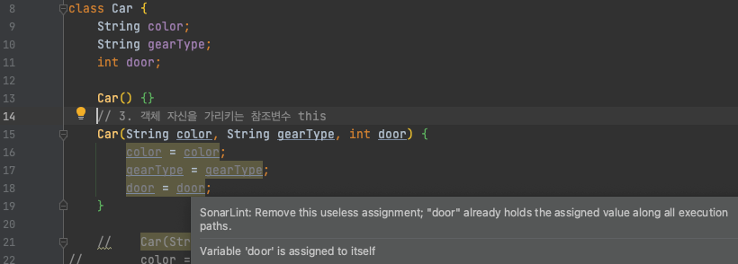
생성자의 매개변수, 인스턴스 변수의 이름이 같아 두 변수의 구분이 되지 않는 경우 (둘 다 지역변수로 간주됨)
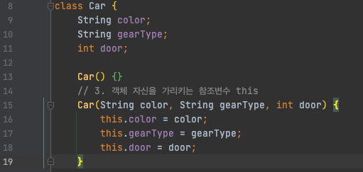
인스턴스 변수 앞에 this.명시 해줌