[Java 정석 7강]
# 객체지향 프로그래밍 (2)

## 상속
### 상속
- 기존의 클래스 재사용하여 새로운 클래스 작성하는 것

- 보다 적은 양의 코드로 신규 클래스 생성 가능, 코드 공통적으로 관리 가능 → 코드 수정 용이  
→ 높은 재사용성, 중복제거를 통해 생산성, 유지보수에 기여
- 자식 클래스는 조상클래스의 모든 멤버 상속받음 (포함관계) / 생성자, 초기화블럭은 상속되지 않는다
  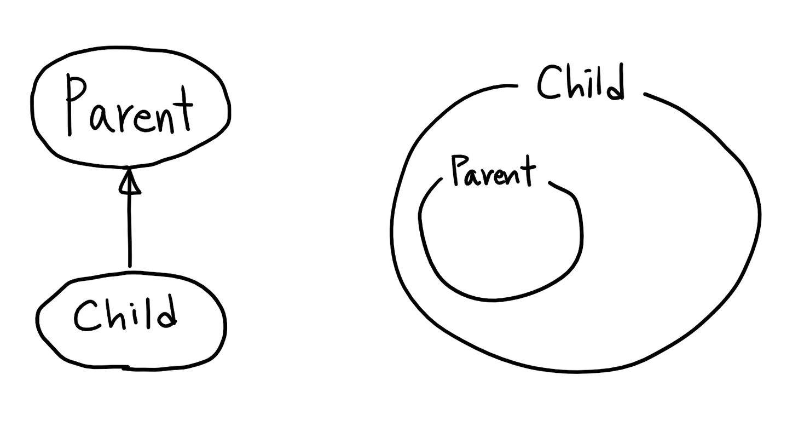

- 자손 클래스의 변경은 조상 클래스에 아무런 영향 주지 않는다.
- 자손 클래스의 멤버 개수는 조상 클래스보다 항상 같거나 많다 (조상 클래스를 확장하는 것)

### 상속/포함 관계
- 포함  
: 한 클래스의 멤버변수로 다른 클래스 타입의 참조변수 선언하는 것
  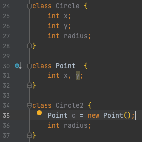

```
1. 상속
   ~은 ~이다 (is - a)
2. 포함
   ~은 ~을 가지고 있다 (has - a)

   ex) 원(Circle)은 점(Point)을 가지고 있다.
```

### Object 클래스
- 상속계층도 최상위에 있는 조상 클래스 (생략)
- 다른 클래스 상속받지 않는 클래스들은 자동적으로 Object 클래스 상속받는 것

### 오버라이딩 (Overriding)
- 조상 클래스로부터 상속받은 메서드의 내용만 변경하는 것
- 메서드 선언부 (일치) / 접근제어자, 예외 (조건부 변경)

```
1. 선언부가 조상 클래스의 메서드와 일치해야 한다
2. 접근 제어자는 조상 클래스의 메서드보다 좁은 범위로 변경할 수 없다
   ex) public - protected - (default) - priviate
   조상: protected / 자식: protected, public 만 가능
3. 조상 클래스보다 많은 수의 예외 선언할 수 없다.

오버로딩(overloading)
- 기존에 없는 새로운 메서드 정의 (new)
  오버로딩(overriding)
- 상속받은 메서드의 내용 변경하는 것 (change, modify)
```

***

### 참조변수 super
- 조상의 멤버 / 자신의 멤버 구별하는데 사용
- 모든 인스턴스 메서드에는 this, super가 지역변수로 존재하며, 자신이 속한 인스턴스의 주소가 자동으로 저장된다
  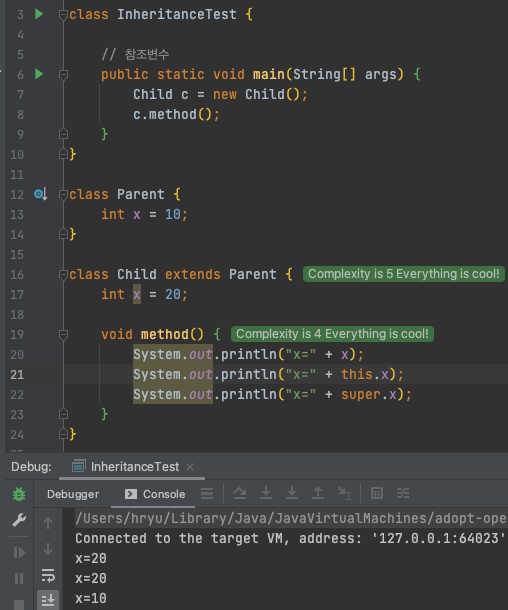
조상에게 상속받은 x, 자식 클래스의 x 변수는 이름은 같으나 다른 값!
    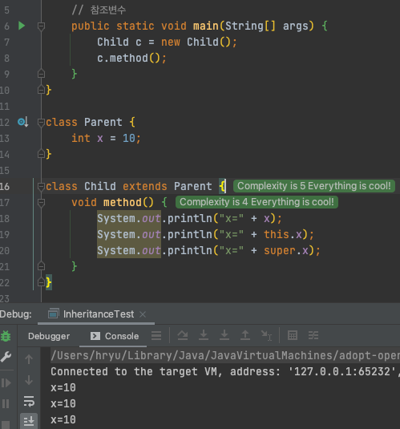
x가 같은 변수 의미하므로 값 동일
  
###생성자 super()
- 조상의 생성자 호출할 때 사용
- 조상의 멤버는 조상의 생성자를 통해 초기화되도록 작성하기
- 생성자는 상속되지 않으며, 자신의 클래스에 선언된 변수는 자신의 생성자가 초기화를 책임지는 것이 좋다
  .png)
super()를 통해 조상클래스의 생성자를 호출
  
***

## 제어자(modifier)
접근 제어자는 한번에 한가지만 사용 가능

```
접근 제어자: public, protected, default, private
그     외: static, final, abstract, native, transient, synchronized, volatile, strictfp
```

* static  
‘클래스의’, ‘공통적인’ → 하나의 클래스변수(static 멤버변수)를 모든 인스턴스가 공유
  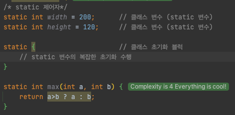
사용될 수 있는 곳 - 메서드, 멤버변수, 초기화 블럭
  

* final  
‘마지막의’, ‘변경될 수 없는’ → 값을 변경할 수 없는 변수(상수) / 오버라이딩 할 수 없는 메서드 / 자손클래스 둘 수 없는 확장 불가능한 클래스
  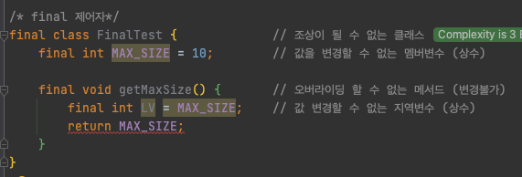
사용될 수 있는 곳 - 클래스, 메서드, 멤버변수, 지역변수

* abstract  
‘추상의’, '미완성의 → 선언부만 작성되고, 실제 수행내용은 구현하지 않은 것  
추상 클래스는 아직 완성되지 않은 메서드가 존재하므로, 인스턴스 생성 불가
  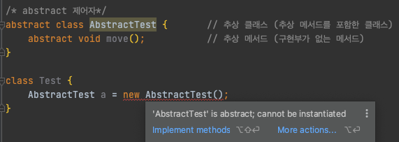
사용될 수 있는 곳 - 클래스, 메서드

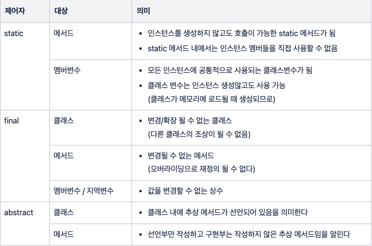


### 접근 제어자 (access modifier)
- 해당 대상을 외부에서 접근하지 못하도록 제한하는 역할
- public > protected > (default) > private
  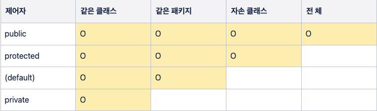

***

### 캡슐화 (Encapsulation)
- get() - 멤버변수의 값 반환
- set() - 조건에 맞는 값일 경우 멤버변수의 값 변경
- private가 붙은 멤버는 자손 클래스에서도 접근 불가능 → 상속 통해 확장될 클래스라면, protected 사용할 것
- 클래스의 내부에 선언된 데이터를 보호하기 위해 → data hiding, encapsulation

```
1. 외부로부터 데이터 보호하기 위해
2. 외부에는 불필요한, 내부적으로만 사용되는 부분을 감추기 위해
```

### 다형성 (Polymorphism)
- 같은 타입의 인스턴스여도, 참조변수의 타입에 따라 사용할 수 있는 멤버의 개수 다름
```
조상타입의 참조변수로 자손타입의 인스턴스 참조할 수 있다.
자손타입의 참조변수로 조상타입의 인스턴스 참조할 수 없다.
```
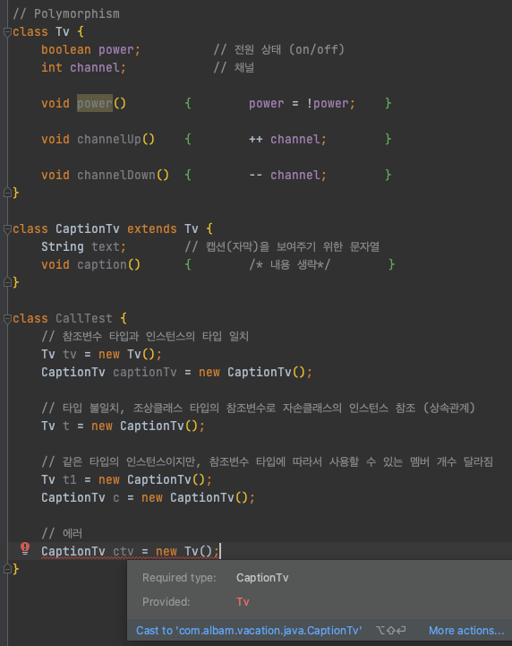
실제 인스턴스보다 참조변수가 사용할 수 있는 멤버 개수가 더 많은 경우 에러 발생!

### 참조변수의 형변환
- 서로 상속관계인 타입의 형변환은 양방향이나,  
참조변수가 가리키는 인스턴스의 자손타입으로 형변환은 허용되지 않음  
→ 참조변수가 가리키는 인스턴스의 타입이 무엇인지 먼저 확인하는 것이 중요
- 조상의 조상으로도 형변환 가능 → 모든 참조변수는 모든 클래스의 조상인 Object클래스 타입으로 형변환 가능
- 조상타입으로의 형변환 생략 → 조상타입으로 형변환 할 경우, 다룰 수 있는 멤버 개수 감소하여 안전해짐

```
class Car { }
class FireEngine extends Car { }
class Ambulance  extends Car { }


FireEngine f = new FireEngine();
Car c = (Car)f;                 // OK. 조상인 Car 타입으로 형변환 (생략가능)
FireEngine f2 = (FireEngine)c;  // OK. 자손인 FireEngine 타입으로 형변환 (생략불가)
Ambulance a = (Ambulance)f;     // ERROR. 상속관계가 아닌 클래스 간 형변환 불가

Car c = f;                      // f의 값(객체의 주소) c에 저장
                                // 타입 일치시키기 위해 형변환 필요 (생략가능 - 생략된 상태)
f = (FireEngine)c;              // 조상->자손 타입으로 형변환은 생략불가
```
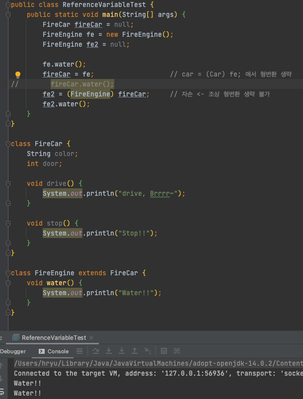
FireCar 타입의 참조변수로는 FireEngine의 메서드 호출 불가!


### 매개변수의 다형성
- 매개변수가 조상클래스 타입의 참조변수라는 것  
→ 메서드의 매개변수로 자손타입의 참조변수면 어느것이나 매개변수로 받을 수 있다는 것
  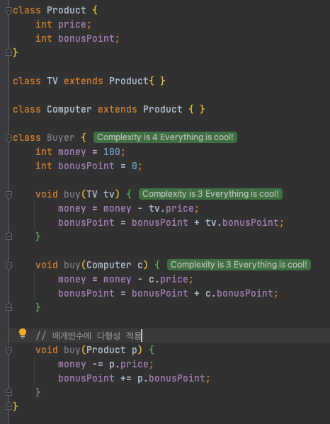
다른 제품 클래스를 추가하더라도 Product 클래스 상속받기만 하면
buy(Product p)메서드의 매개변수로 받아들여질 수 있다

***

## 추상
키워드 ‘abstract’ 사용

### 추상화
- ‘낱낱의 개념에서 공통된 성질을 뽑아 일반적인 개념으로 파악하는 것’

```
상속  : 자손 클래스 만드는데 조상 클래스 사용하는 것
추상화 : 기존 클래스의 공통부분을 뽑아 조상 클래스 만드는 것  
상속 계층도를 따라 내려갈수록 세분화, 올라갈수록 공통요소만 존재!
```

### 추상 클래스 (abstract class)
- 공통 부분만을 가지는 미완성 설계도 (일반 클래스는 완성된 설계도)  
미완성 메서드(추상 메서드)를 포함하고 있는 클래스
- 인스턴스를 생성할 수 없음
- 조상클래스  
: 자손 클래스에 의해서만 완성될 수 있음(상속)  
: 새로운 클래스 작성의 바탕이 됨
- 추상 메서드를 포함한 것 외에는 일반 클래스와 똑같음 (메서드, 생성자, 멤버변수 가짐)

```
abstract class 클래스명 {
    ...
}
```

### 추상 메서드 (abstract method)
- 선언부만 작성하고, 구현부는 작성하지 않은 것
- 실제 내용은 상속받는 클래스에서 구현하도록 비워두는 것 (상속받는 클래스에 따라 달라질 수 있으므로)
```
abstract 리턴타입 메서드명();
```
- 자식 클래스는 오버라이딩을 통해 조상의 추상 메서드를 모두 구현해야함  
(하나라도 구현하지 않는다면 자손 역시 추상 클래스 되어야함)

### 인터페이스 (interface)
- 추상 클래스보다 추상화 정도가 높아서 추상 메서드와 상수만을 멤버로 가질 수 있음
```
추상클래스 : 부분적으로만 완성된 '미완성 설계도'
인터페이스 : 구현된 것은 아무것도 없고 밑그림만 그려져 있는 '기본 설계도'

- 모든 멤버변수는 public static final (생략 가능)
- 모든 메서드는 public abstract (생략 가능 - static, 디폴트 메서드 제외)

interface 인터페이스명 {
    public static final 타입 상수명 = 값;
    public abstract 메서드명(매개변수목록);
}
```
- 다중 상속 가능 (클래스와 달리 Object 클래스같은 최고 조상이 없음)
```
interface Movable {
void move(int x, int y);
}

interface Attackable {
void attack(Unit u);
}

interface Fightable extends Movable, Attackable { }
```
- 추상 클래스가 상속을 통해 추상메서드 완성하듯,  
인터페이스에 정의된 추상 메서드를 구현하는 클래스 필요

```
class 클래스명 implements 인터페이스명 {
    // 인터페이스에 정의된 추상메서드 모두 구현해야 함
}

# 1. 모두 구현할 때
class Fighter implements Fightable {
    public void move(int x, int y){ ... }
    public void attack(Unit u){ ... }
}

# 2. 일부만 구현할 때
abstract class Fighter implements Fightable {
    public void move(int x, int y){ ... }
}

# 3. 상속, 구현 동시에 할 때
class Fighter extends Unit implements Fightable {
    public void move(int x, int y){ ... }
    public void attack(Unit u){ ... }
}
```
- 인터페이스를 이용한 다형성  
  > 인터페이스는 이를 구현한 클래스의 조상  
→ 해당 인터페이스 타입의 참조변수로 이를 구현한 클래스의 인스턴스 참조 / 인터페이스 타입으로 형변환 가능

```
Fightable f = (Fightable) new Fighter();
Fightable f = new Fighter();

# 1-1. 인터페이스는 메서드의 매개변수의 타입으로도 사용 가능
void attack(Fightable f) { // 인터페이스 타입의 매개변수
    ...
}

# 1-2. 메서드 호출 시, 해당 인터페이스를 구현한 클래스의 인스턴스를 매개변수로 제공해야 함
class Fighter extends Unit implements Fightable {
    public void move(int x, int y) { ... }
    public void attack(Fightable f) { ... }
}

# 2. 메서드의 리턴타입으로 인터페이스 지정하는 것도 가능
# => 메서드가 해당 인터페이스를 구현한 클래스의 인스턴스 반환한다는 뜻!
Fightable method() {
    ...
    Fighter f = new Fighter();
    return f
    // return new Fighter();
}
```

- 인터페이스의 장점
``` 
1. 개발시간 단축시킬 수 있음
- 인터페이스 작성되면 메서드 호출부에서는 선언부만 알면 되기 때문에,
  프로그램 작성 &  인터페이스 구현 클래스 → 동시 개발 가능

2. 표준화 가능
- 프로젝트의 기본 틀 - 인터페이스로 생성 → 일관된, 정형화된 프로그램 개발 가능

3. 서로 관계없는 클래스 - 관계맺기 가능
- 하나의 인터페이스를 공통적으로 구현 → 연관관계 없는 클래스들 관계맺기 가능

4. 독립적인 프로그래밍 가능
- 클래스-클래스 간 직접적 관계를 인터페이스를 사용한 간접적 관계로 변경
  → 한 클래스의 변경이 다른 클래스에 영향 주지 않음
```

### default / static 메서드
- 인터페이스에 메서드 추가한다 == 추상 메서드를 추가한다  
→ 해당 인터페이스를 구현한 모든 기존 클래스들이 새로운 메서드를 구현해야 한다

- default 메서드  
: 추상 메서드의 기본적인 구현 제공  
→ 추상 메서드가 아니기 때문에, 새로 추가되어도 해당 인터페이스를 구현한 클래스 변경하지 않아도 됨
```  
interface MyInterface {
void method();
void newMethod(); // 추상 메서드
default void newMethod() {} // 디폴트 메서드
}
```
- 메서드명 중복되어 충돌하는 경우 → 필요한 쪽의 메서드와 같은 내용으로 오버라이딩
```
1. 여러 인터페이스의 디폴트 메서드 간 충돌
- 인터페이스 구현한 클래스에서 디폴트 메서드를 오버라이딩해야 함
2. 디폴트 메서드와 조상 클래스의 메서드 간 충돌
- 조상클래스의 메서드 상속되고, 디폴트 메서드는 무시됨
```

### 내부 클래스 (inner class)
- 클래스 내 선언된 클래스 → 서로 긴밀한 관계일 경우
- 내부 클래스에서 외부 클래스의 멤버들을 쉽게 접근할 수 있음
- 코드의 복잡성 줄일수 있음 (캡슐화)

```
class A {
}
class B {
}

class A {
    class B {
        // A를 제외한 다른 클래스에서 잘 사용되지 않는 것이어야 함
    }
}
```
- 내부 클래스의 선언 위치에 따라 같은 선언위치의 변수와 동일한 유효범위, 접근성 가짐
  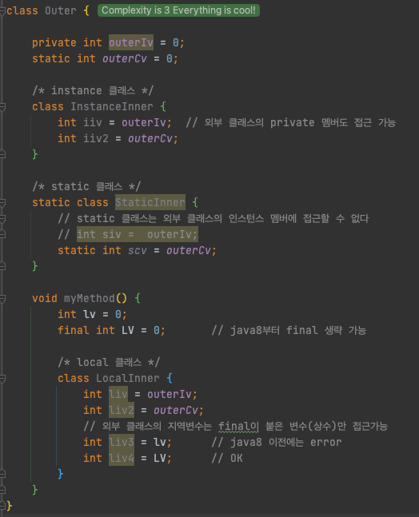
instance 클래스는 외부 클래스의 인스턴스 멤버로, 모든 변수에 접근할 수 있다 (private 포함)  
static 클래스는 외부 클래스의 static 멤버로, static 멤버에만 접근 가능하다  
local 클래스는 모든 멤버를 사용할 수 있고, 해당 클래스가 포함된 메서드의 final 지역변수도 사용할 수 있다.
