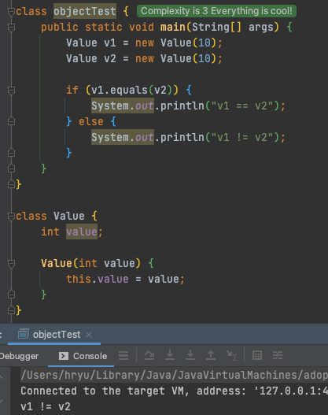
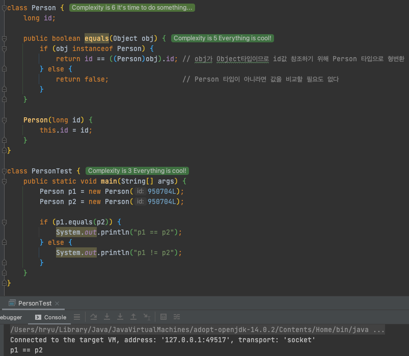
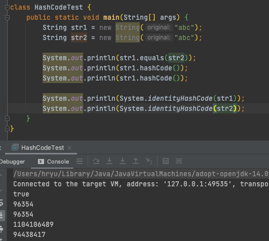

[Java 정석 9강]
# java.lang 패키지와 유용한 클래스

## Object 클래스
java.lang 패키지는 자바 프로그래밍에 가장 기본이 되는 클래스들로, import하지 않아도 사용 가능  
(그동안 String, System 클래스를 import하지 않아도  쓸 수 있던 이유)

***

### equals()
- 매개변수로 객체의 참조변수를 받아 비교 후 결과 boolean으로 리턴
```
public boolean equals(Object obj) {
    return (this == obj);     // 두 객체의 같고 다름을 참조변수의 값으로 판단! -> 항상 false
}
```
- 메모리의 빈 공간에 객체 생성  
→ 서로 다른 두 개의 객체가 같은 주소 갖는 일은 불가능  
→ but 두 개 이상의 참조변수가 같은 주소값 갖는 것은 가능 (한 객체를 참조)



### equals()의 오버라이딩
Object 클래스로부터 상속받은 equals 메서드는 결국  
두 개의 참조변수가 같은 객체 참조하고 있는가? (두 참조변수에 저장된 값이 같은가) 판단하는 것만 할 수 있으므로  
→ equals()를 오버라이딩하여 주소가 아닌 객체에 저장된 내용을 비교하도록 변경하면 됨!

서로 다른 인스턴스일지라도 같은 id를 가지고 있다면 true 결과 얻을 수 있다.

***

### hashCode()
- 해싱: 다량의 데이터 저장, 검색하는데 유용
- 해시함수 - 찾고자 하는 값 입력 시 저장된 위치를 알려주는 ‘hashCode’ 반환
- 서로 다른 두 객체는 결코 같은 hashCode 가질 수 없다  
→ Object 클래스에 정의된 해시코드는 객체의 주소값을 이용하여 hashCode 생성하므로..  
→ 일반적으로는 hashCode 같은 두 객체 존재 가능



- String 클래스는 문자열의 내용이 같으면 동일한 hashCode 반환하도록 메서드 오버라이딩 되어있음!
- System.identityHashCode(Object x)는 객체의 주소값으로 해시코드 생성  
→ 모든 객체에 대해 항상 다른 hashCode 반환  
→ 위 예제의 두 객체는 hashCode는 같으나 서로 다른 객체인 것

***

### toString()
- 인스턴스에 대한 정보를 문자열(String)으로 제공
- ‘인스턴스의 정보 제공’ → 인스턴스 변수에 저장된 값들을 문자열로 표현한다

***

### String 클래스

- char 배열도 가능하지만, 문자열을 위한 String 클래스 사용
- String 클래스는 immutable  
→ '+' 연산자로 문자열 결합하는 경우, 인스턴스 내 문자열이 바뀌는 것이 아닌  
새로운 문자열이 담긴 String 인스턴스가 생성되는 것! (메모리 공간 차지)  
→ StringBuffer 클래스로 문자열 변경하며 작업하는 것이 좋음

### StringBuilder
StringBuffer는 멀티쓰레드에 안전하도록 동기화되어 있다.  
→ 쓰레드의 동기화만 제거한 StringBuilder 쓰는것이 더 효율적 (반드시 성능향상이 필요한 경우!)

```
StringBuffer sb;
sb = new StringBuffer();
sb.append("abc");

StringBuilder sb;
sb = new StringBuilder();
sb.append("abc");
```

***

### 래퍼(Wrapper) 클래스
- 기본형 값을 객체로 다룰 수 있다
- 매개변수로 객체 요구, 기본형 값이 아닌 객체로 저장, 객체 간 비교 필요, 등   
  → 기본형 값을 객체로 변환하여 작업해야 함
- 모두 equals() 오버라이딩 중!
```
기본형 -> 래퍼 : AutoBoxing
기본형 <- 래퍼 : UnBoxing
```