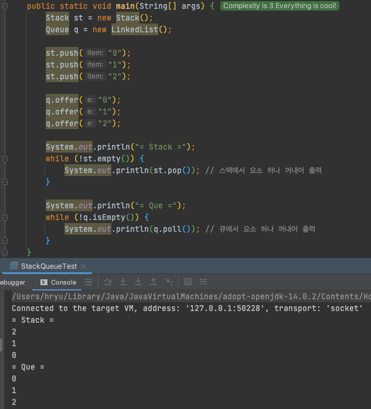
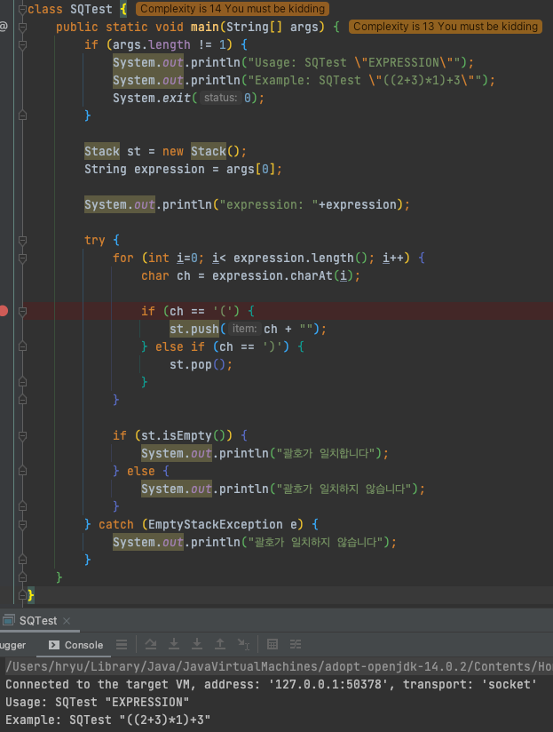
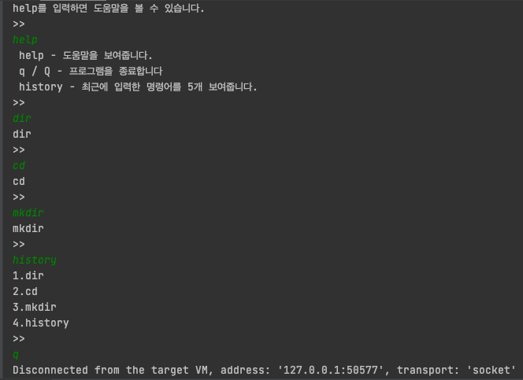

[Java 정석 11강]
# 컬렉션 프레임웍

## Stack & Queue

### 예제 1

스택은 넣을때와 반대되는 순서, 큐는 넣을때와 같은 순서

- Stack: Last In First Out
- Queue: First In First Out

```
[활용 예]

스택  - 수식계산, 수식 괄호 검사, 웹 브라우저의 뒤로/앞으로
큐   - 최근 사용 문서, 인쇄작업 대기목록, 버퍼 
```

***

### 예제 2
입력한 수식의 괄호 올바른지 체크하기


***

### 예제 3
unix의 history 명령어 구현하기 (Queue)s

```
class QTest {

    static Queue q = new LinkedList();
    static final int MAX_SIZE = 5; // Queue에 최대 5개까지만 저장되도록 한다

    public static void main(String[] args) {
        System.out.println("help를 입력하면 도움말을 볼 수 있습니다.");

        while (true) {
            System.out.println(">>");
            try {
                // 화면으로부터 라인단위로 입력받는다.
                Scanner s = new Scanner(System.in);
                String input = s.nextLine().trim();

                if ("".equals(input)) {
                   continue;
                }
                if (input.equalsIgnoreCase("q")) {
                    System.exit(0);
                } else if (input.equalsIgnoreCase("help")) {
                    System.out.println(" help - 도움말을 보여줍니다.");
                    System.out.println(" q / Q - 프로그램을 종료합니다");
                    System.out.println(" history - 최근에 입력한 명령어를 " + MAX_SIZE + "개 보여줍니다.");
                } else if (input.equalsIgnoreCase("history")) {
                    int i = 0;
                    // 입력받은 명령어 저장
                    save(input);

                    LinkedList tmp = (LinkedList)q;
                    ListIterator it = tmp.listIterator();

                    while (it.hasNext()) {
                        System.out.println(++i + "." + it.next());
                    }
                } else {
                    save(input);
                    System.out.println(input);
                }
            } catch (Exception e) {
                System.out.println("입력 오류입니다.");
            }
        }
    }

    public static void save(String input) {
        // Queue에 저장한다
        if (!"".equals(input)) {
            q.offer(input);
        }

        // Queue의 최대크기 넘으면 제일 처음 입력된 것 삭제한다
        if (q.size() > MAX_SIZE) {   // size()는 Collection 인터페이스에 정의
            q.remove();
        }
    }
}
```
